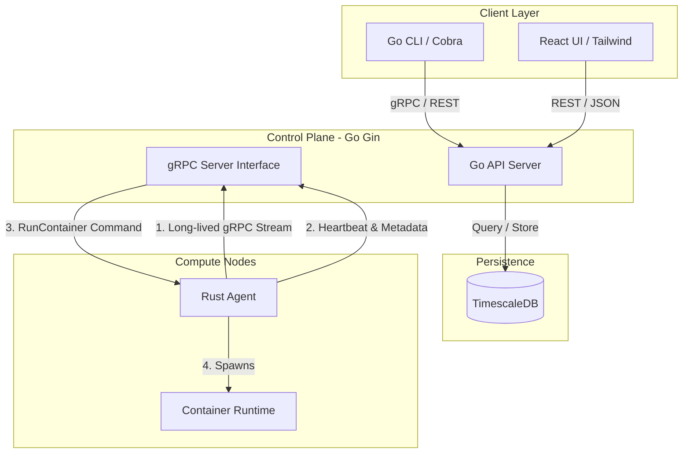

# Architecture

```mermaid
graph TD
    subgraph Client_Layer [Client Layer]
        CLI[Go CLI / Cobra]
        UI[React UI / Tailwind]
    end

    subgraph Server_Layer [Control Plane - Go Gin]
        API[Go API Server]
        GRPC_S[gRPC Server Interface]
    end

    subgraph Data_Layer [Persistence]
        DB[(TimescaleDB)]
    end

    subgraph Edge_Layer [Compute Nodes]
        Agent[Rust Agent]
        Docker[Container Runtime]
    end

    %% Communication Flows
    CLI -- "gRPC / REST" --> API
    UI -- "REST / JSON" --> API
    API -- "Query / Store" --> DB

    %% Agent Connection
    Agent -- "1. Long-lived gRPC Stream" --> GRPC_S
    Agent -- "2. Heartbeat & Metadata" --> GRPC_S
    GRPC_S -- "3. RunContainer Command" --> Agent
    Agent -- "4. Spawns" --> Docker
```
