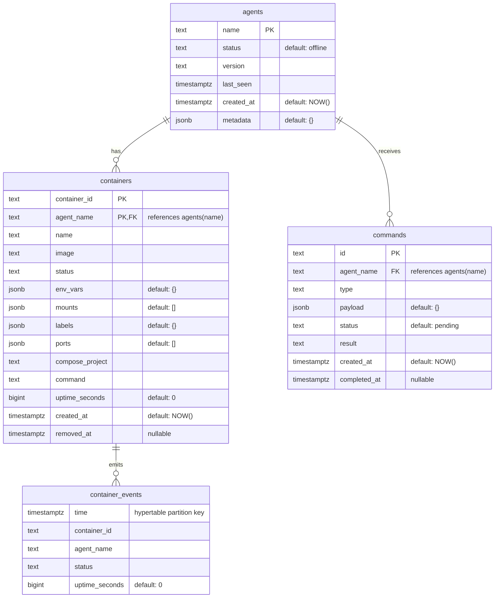

# Database Schema

Pulse uses **TimescaleDB** (PostgreSQL) with migrations managed by [golang-migrate](https://github.com/golang-migrate/migrate). Migration files live in `api/internal/db/migrations/`.

## ER Diagram

## Tables

### `agents`

Tracks compute nodes registered with the control plane.

| Column       | Type        | Constraints              | Notes                                             |
|-------------|-------------|--------------------------|---------------------------------------------------|
| `name`       | `TEXT`      | **PK**                   | Case-insensitive unique index (`LOWER(name)`)     |
| `status`     | `TEXT`      | `NOT NULL DEFAULT 'offline'` | `online`, `offline`, or `lost`              |
| `version`    | `TEXT`      | `NOT NULL DEFAULT ''`    | Agent binary version                              |
| `last_seen`  | `TIMESTAMPTZ` | nullable              | Updated on each heartbeat                         |
| `created_at` | `TIMESTAMPTZ` | `NOT NULL DEFAULT NOW()` |                                                 |
| `metadata`   | `JSONB`     | `NOT NULL DEFAULT '{}'`  | Node info: hostname, IP, OS, kernel, uptime, etc. |

### `containers`

Current state of containers across all agents. Soft-deleted via `removed_at`.

| Column            | Type        | Constraints                     | Notes                          |
|------------------|-------------|---------------------------------|--------------------------------|
| `container_id`    | `TEXT`      | **PK** (composite)              | Docker container ID            |
| `agent_name`      | `TEXT`      | **PK** (composite), **FK** → `agents(name) ON DELETE CASCADE` |          |
| `name`            | `TEXT`      | `NOT NULL DEFAULT ''`           |                                |
| `image`           | `TEXT`      | `NOT NULL DEFAULT ''`           |                                |
| `status`          | `TEXT`      | `NOT NULL DEFAULT ''`           |                                |
| `env_vars`        | `JSONB`     | `NOT NULL DEFAULT '{}'`         | Key-value pairs                |
| `mounts`          | `JSONB`     | `NOT NULL DEFAULT '[]'`         | String array                   |
| `labels`          | `JSONB`     | `NOT NULL DEFAULT '{}'`         | Key-value pairs                |
| `ports`           | `JSONB`     | `NOT NULL DEFAULT '[]'`         | Array of port mapping objects  |
| `compose_project` | `TEXT`      | `NOT NULL DEFAULT ''`           |                                |
| `command`         | `TEXT`      | `NOT NULL DEFAULT ''`           |                                |
| `uptime_seconds`  | `BIGINT`    | `NOT NULL DEFAULT 0`            |                                |
| `created_at`      | `TIMESTAMPTZ` | `NOT NULL DEFAULT NOW()`     |                                |
| `removed_at`      | `TIMESTAMPTZ` | nullable                     | Set when container disappears  |

### `container_events`

Time-series data (TimescaleDB hypertable) recording container state over time.

| Column           | Type        | Constraints          | Notes                            |
|-----------------|-------------|----------------------|----------------------------------|
| `time`           | `TIMESTAMPTZ` | `NOT NULL`        | Hypertable partition column      |
| `container_id`   | `TEXT`      | `NOT NULL`           |                                  |
| `agent_name`     | `TEXT`      | `NOT NULL`           |                                  |
| `status`         | `TEXT`      | `NOT NULL`           |                                  |
| `uptime_seconds` | `BIGINT`    | `NOT NULL DEFAULT 0` |                                  |

**Policies:**
- Compression after **7 days** (segmented by `container_id, agent_name`, ordered by `time DESC`)
- Retention: drop chunks older than **30 days**

### `commands`

Queued commands sent to agents via the control plane.

| Column         | Type        | Constraints                     | Notes                                    |
|---------------|-------------|---------------------------------|------------------------------------------|
| `id`           | `TEXT`      | **PK**                          | UUID                                     |
| `agent_name`   | `TEXT`      | `NOT NULL`, **FK** → `agents(name) ON DELETE CASCADE` |                        |
| `type`         | `TEXT`      | `NOT NULL`                      | `run_container`, `stop_container`, `restart_container`, `pull_image`, `compose_up`, `send_file`, `request_logs` |
| `payload`      | `JSONB`     | `NOT NULL DEFAULT '{}'`         | Command-specific parameters              |
| `status`       | `TEXT`      | `NOT NULL DEFAULT 'pending'`    | `pending`, `completed`, or `failed`      |
| `result`       | `TEXT`      | `NOT NULL DEFAULT ''`           | Output or error message                  |
| `created_at`   | `TIMESTAMPTZ` | `NOT NULL DEFAULT NOW()`     |                                          |
| `completed_at` | `TIMESTAMPTZ` | nullable                     | Set when agent reports back              |

## Indexes

| Index                         | Table              | Columns                        | Type   |
|------------------------------|--------------------|---------------------------------|--------|
| `idx_agents_name_lower`       | `agents`           | `LOWER(name)`                  | UNIQUE |
| `idx_containers_agent`        | `containers`       | `agent_name`                   | BTREE  |
| `idx_containers_status`       | `containers`       | `status`                       | BTREE  |
| `idx_containers_labels`       | `containers`       | `labels`                       | GIN    |
| `idx_containers_env_vars`     | `containers`       | `env_vars`                     | GIN    |
| `idx_containers_ports`        | `containers`       | `ports`                        | GIN    |
| `idx_events_container`        | `container_events` | `container_id, time DESC`      | BTREE  |
| `idx_commands_agent_status`   | `commands`         | `agent_name, status`           | BTREE  |
